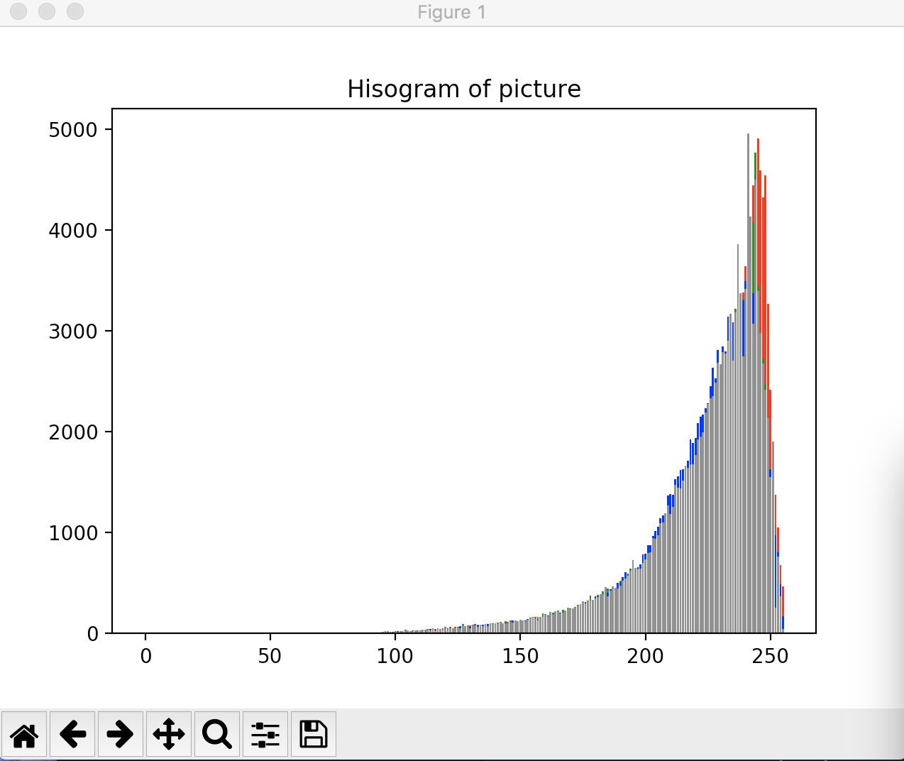

## The code is used to manually create Histogram of images. Before running the code, you will need a image and the code at the same direction

# command line on Terminal: python3 codeName.py --first imageName.For example:python3 histogram.py --first under.jpg

# then the code will calculate the histogram of the image, the output histogram will be output

## demonstration
# input image

# the histogram of the image

