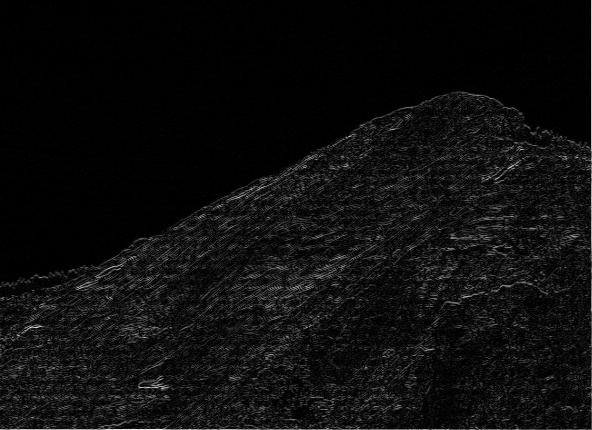

# Using python to apply Robert, Sobel and Lapalce derivative on image

## input an target image

## apply Robert

## apply Sobel

## apply Laplace, this is second derivative

## as we can see above, the output image of Robert is the most dark one, the output image of Sobel is the most lighter one, and the output of laplace is in middle.
