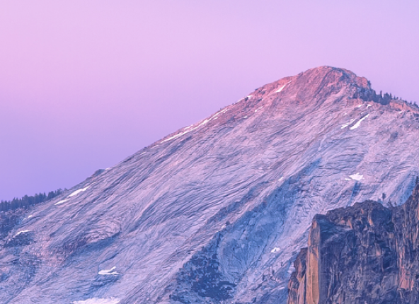

# Using python to unsharpen and high boost filter in images

## input an target image

## apply GaussianBlur to create gauss_mask and unsharpen the image using gauss_mask and the output image will more lighter and sharper like this

## then we create a kernel and apply High Pass Filter on the sharpen image, the result image will be like

## very beautiful image ! 
