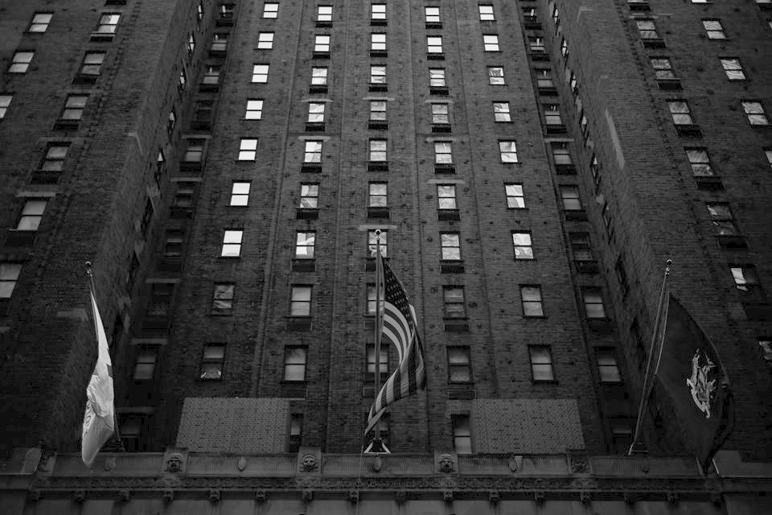

# Using python to apply gamma transformation on Images

## The concept is read image from local file and transform it to gray image if its a color image.
## then we apply pre-define gamma transformation method to transform the image and save it to the local file.
### finally, we display original image histogram and the histogram of image that applied gamma transformation.

## input an overexposure image

## input another underexposure image

## output of overexposure image after applied gamma transformation

## output of underexposure image after applied gamma transformation

## histogram of 4 images
### blue: original overexposure image
### orange: original underexposure image
### green: overexposure image after applied gamma transformation
## red: underexposure image after applied gamma transformation

